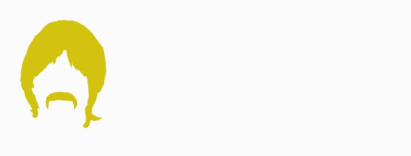

<div align="left">



<h1>Tom de Go</h1>

  [](https://github.com/fruetalo182/tom-de-go/actions/workflows/ci.yaml)
  


</div>

```Tom de Go``` is one of the three members deployed on ```cluster182```

## 📋 Requirements

- **Go version:** 1.21 or higher

## ⚙️ Local setup

1. Clone this repository:
    ```bash
    git clone https://github.com/fruetalo182/tom-de-go.git
    cd tom-de-go
    ```
2. Test the application (Optional):
    ```bash
    go test /cmd/server/main.go
    ```
3. Run the application:
    ```bash
    go run /cmd/server/main.go
    ```
4. Open your browser at [http://localhost:8080](http://localhost:8080) to access.

## 🐳 Docker setup

To run the Tom de Go application using Docker, follow these steps:

1. **Pull the Docker image**:

    ```bash
    docker pull ghcr.io/fruetalo182/tom-de-go:latest
    ```

2. **Run the Docker container**:

    ```bash
    docker run -p 8080:8080 tom-de-go
    ```

3. **Access the application** at [http://localhost:8080](http://localhost:8080).
